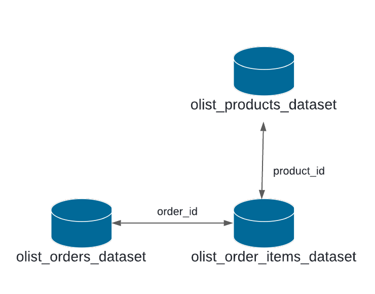

# Olist Assignment - Data Pipeline 2

For this assignment, I will use a kaggle a public dataset of orders made at Olist Store, a Brazilian ecommerce site.
For the result I need to identify the list of customers having late deliveries (more than 10 days).

Requirements:
- Using olist dataset https://www.kaggle.com/olistbr/brazilian-ecommerce, identify all late deliveries, 
  so that we can provide a 10% discount on next delivery to boost the sales.
- **order_purchase_timestamp** is by default in Sao Paulo timezone.
- **order_delivered_customer_date** is by default in the customer delivery address timezone.


### Pre-requisites: 
- Install Apache Spark
- Install mill


### How to run: 

- Clone repo `git clone https://github.com/dianapatrong/datapipeline2-olist-assignment.git`
- Download data from kaggle https://www.kaggle.com/datasets/olistbr/brazilian-ecommerce
  - Unzip the `archive.zip` file
  - Copy archive folder into the folder `data/` inside the repository
    
- Inside the root of the repository, run the following command: `$ mill spark.standalone.run`
  
- The logs should be similar to the below image: 
  


  Alternatively we could run our script using `spark-submit`, but we will need the jar file, this will be covered on the "How to run on AWS" section
  ```  
$ spark-submit --class OlistCli out/spark/assembly.dest/out.jar data/archive/ output/
  ```

- Go to `output/late_deliveries` folder to get the result in CSV format

### Result explanation
 For getting the deliveries that were late for more than 10 days I used the following files: 
 * `olist_orders_dataset.csv` -> to get information regarding which orders were late and from which customers 
 * `olist_order_items_dataset.csv` -> helper to identify which kind of product was ordered
 * `olist_products_dataset.csv` -> to identify the kind of product that was being delivered late

1. Read the `olist_orders_dataset.csv` and convert `order_delivered_customer_date` and `order_purchase_timestamp` into UTC timestamp from a timezone of Sao Paolo
```
NOTE: I'm taking into account that the columns order_purchase_timestamp and order_delivered_customer_date are by default in Sao Paolo timezone 
```
2. Calculate the difference in days from the columns previously converted to get the late deliveries
3. Filter the data to only include the deliveries that were more than 10 days late
4. Verify output inside `output/customers_with_late_deliveries`

Extra:
Since I wanted to know what kind of products were delivered late I did the following: 
4. Read the `olist_order_items_dataset.csv` and `olist_products_dataset.csv` csv's and joined them to get the product information.
5. Verify output CSV inside `output/late_deliveries_with_product_information`




## How to run on AWS 

### On your local:
- Run `$ mill spark.assembly`
- Verify `out.jar` is created `$ ls out/spark/assembly.dest/`
  
### On AWS: 
#### Create an S3 bucket
On AWS S3, create an S3 bucket i.e. `spark-scala-olist` and mark the checkbox **Block all public access**
  
    - Create the prefixes `jobs` and `data`
    - Upload the `out.jar` into the `jobs` prefix in s3 => `s3://spark-scala-olist/jobs/`
      
    - Upload the unzipped `archive` folder into the `data` prefix in s3 => `s3://spark-scala-olist/data/`
      

#### Create an EMR cluster
On AWS EMR, create a new cluster with the configuration like the image below: 


- Go to **Steps** and verify that `Setup hadoop debugging` is in **Complete** state
  
  

- Add a new step with the following
  - **Step type**: Spark Application
  - **Name**: Olist Assignment
  - **Deploy Mode**: Cluster
  - **Spark-submit options**: `--class OlistCli`
  - **Application location**: `s3://spark-scala-olist/jobs/out.jar`
  - **Arguments**: `s3://spark-scala-olist/data/archive/ s3://spark-scala-olist/output/`
  - Click on **Add**
    
    

- Wait for the step to be in **Completed** state:
  


- Verify we now have an `output` prefix in s3 and we have the csv with the results:
  


```
NOTE: Bucket names are unique across all AWS accounts, don't forget to substitute the bucket name "spark-scala-olist" with yours.
```

